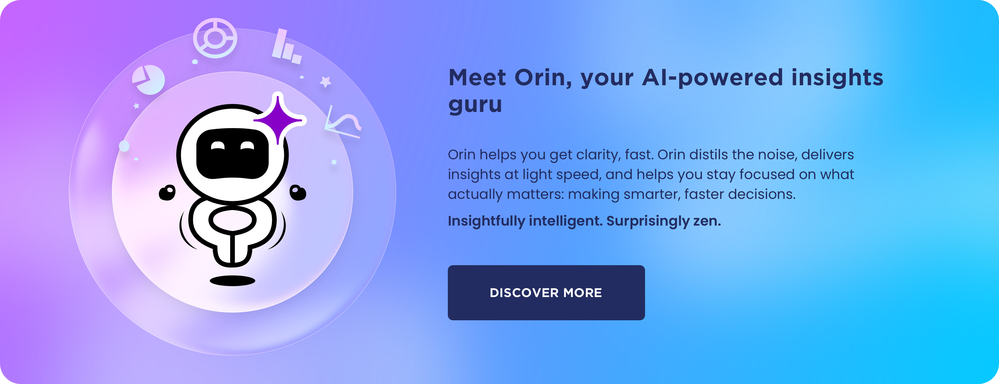

# Apteco documentation

[Apteco](https://help.apteco.com/docs/Content/home.htm)

Everything you need to get the most out of your Apteco software.

-   ## :material-orbit:

    ### Apteco Orbit

    Lorem ipsum dolor sit amet, consectetur adipiscing elit, sed do eiusmod tempor.

    __[:octicons-arrow-right-24: Orbit](orbit/index.md)__

-   ## :lucide-between-horizontal-start:

    ### Apteco Customer Data Platform

    Lorem ipsum dolor sit amet, consectetur adipiscing elit, sed do eiusmod tempor.

    __[:octicons-arrow-right-24: Connect](orbit/connect/index.md)__

-   ## :lucide-megaphone:

    ### What's new

    Lorem ipsum dolor sit amet, consectetur adipiscing elit, sed do eiusmod tempor.

    __[:octicons-arrow-right-24: Releases](releases/index.md)__

[Get started with Orbit](orbit/index.md){ .md-button .md-button--primary } [Connect your data](orbit/connect/index.md){ .md-button }

 

- ### What's new in Orbit

    __Orin dashboard summaries__

    { width=900 }

    Lorem ipsum dolor sit amet, consectetur adipiscing elit. Nulla et euismod nulla. Curabitur feugiat, tortor non consequat finibus, justo purus auctor massa, nec semper lorem quam in massa.

    __[:octicons-arrow-right-24: Read the release notes](releases/index.md)__

!!! tip "Want to stay in the loop?"

    Join the [Apteco Insider Programme](releases/insider-programme.md) to get early access to upcoming features and the opportunity to shape our product development. Lorem ipsum dolor sit amet, consectetur adipiscing elit. Nulla et euismod nulla. Curabitur feugiat, tortor non consequat finibus, justo purus auctor massa, nec semper lorem quam in massa.

## More resources

-   ## :lucide-message-circle-question-mark:

    ### Need support?

    If you didn't find the answer you're looking for, don't worry. Help is available!

    [Contact tech services](https://www.apteco.com/contact){ .md-button .md-button--primary }

-   ## :lucide-graduation-cap:

    ### Apteco academy

    Training, learning hub, etc. You'll find everything you need and so much more.

    [Academy](https://www.apteco.com/learn/academy){ .md-button .md-button--primary }

-   ## :lucide-route:

    ### Software roadmap

    Lorem ipsum dolor sit amet, consectetur adipiscing elit, sed do eiusmod tempor.

    [Roadmap](https://portal.apteco.com/sales-marketing/software-roadmap){ .md-button .md-button--primary }

-   ## :lucide-handshake:

    ### Apteco community

    Lorem ipsum dolor sit amet, consectetur adipiscing elit, sed do eiusmod tempor.

    [Community](https://www.apteco.com/community){ .md-button .md-button--primary }

-   ## :lucide-globe:

    ### Apteco portal

    Portal, ideas, roadmap, partner resources, etc. And so much more.

    [Portal](https://portal.apteco.com/){ .md-button .md-button--primary }

-   ## :lucide-rss:

    ### Blog

    Lorem ipsum dolor sit amet, consectetur adipiscing elit, sed do eiusmod tempor.

    [Blog](https://www.apteco.com/insights){ .md-button .md-button--primary }

