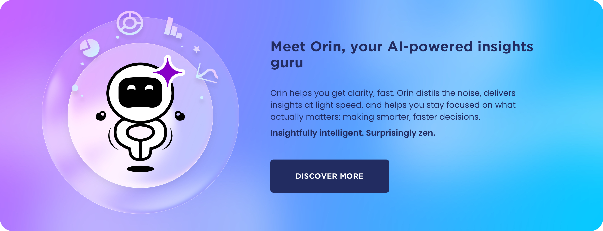

# Apteco documentation

Everything you need to get the most out of your Apteco software.

-   { width="70" }

    ### Apteco Orbit

    An end-to-end actionable marketing insights platform, connecting you with your data.

    __[:octicons-arrow-right-24: Orbit](orbit/index.md)__

-   { width="70" }

    ### Apteco Customer Data Platform

    Unify your customer data in the Apteco Cloud and activate personalised campaigns.

    __[:octicons-arrow-right-24: Connect](orbit/connect/index.md)__

-   { width="70" }

    ### Apteco Email and SMS

    Automate journeys and supercharge your email and SMS marketing.

    __[:octicons-arrow-right-24: Channels](orbit/campaigns/apteco-email/index.md)__

-   { width="70" }

    ### Apteco FastStats

    Lorem ipsum dolor sit amet, consectetur adipiscing elit, sed do eiusmod tempor.

    __[:octicons-arrow-right-24: FastStats](faststats/index.md)__

-   { width="70" }

    ### Apteco PeopleStage

    Lorem ipsum dolor sit amet, consectetur adipiscing elit, sed do eiusmod tempor.

    __[:octicons-arrow-right-24: PeopleStage](peoplestage/index.md)__

-   { width="70" }

    ### FastStats Designer

    Lorem ipsum dolor sit amet, consectetur adipiscing elit, sed do eiusmod tempor.

    __[:octicons-arrow-right-24: Designer](designer/index.md)__

 

!!! success "What's new"

    __Orin dashboard summaries__

    Orin can generate intelligent summaries of your dashboards, providing instant overviews of the insights and visualisations they contain. 

    { width=1100 }

    When you request a dashboard summary, Orin analyses the content and creates a concise description that you can share with colleagues or use to understand unfamiliar dashboards.

    __[:octicons-arrow-right-24: Read the release notes](resources/release-notes/orbit/2026.md)__

---

## Need support?

If you didn't find the answer you're looking for, don't worry. 

We're here to help!

[Contact tech services](mailto:support@apteco.com){ .md-button .md-button--primary }
