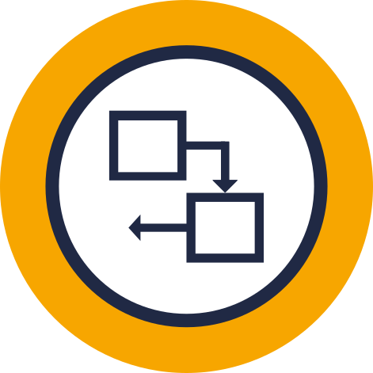
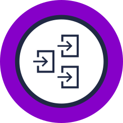

# Apteco documentation

Everything you need to get the most out of your Apteco software.

 

-   { width="70" }

    ### Apteco Orbit

    Analyse data and manage targeted campaigns, all on one intuitive platform.

    __[:octicons-arrow-right-24: Orbit](orbit/index.md)__

-   { width="70" }

    ### Apteco Customer Data Platform

    Unify your customer data in the Apteco Cloud to activate personalised campaigns.

    __[:octicons-arrow-right-24: Connect](orbit/connect/index.md)__

-   { width="70" }

    ### Apteco Email and SMS

    Automate journeys and supercharge your email and SMS marketing.

    __[:octicons-arrow-right-24: Channels](orbit/campaigns/apteco-email/index.md)__

---

-   { width="70" }

    ### Apteco FastStats

    Analyse millions of customer data records in seconds and turn your insights into action.

    __[:octicons-arrow-right-24: FastStats](faststats/index.md)__

-   { width="70" }

    ### Apteco PeopleStage

    Build powerful campaigns and orchestrate journeys across all your channels.

    __[:octicons-arrow-right-24: PeopleStage](peoplestage/index.md)__

-   { width="70" }

    ### FastStats Designer

    Configure and build powerful FastStats databases from external data sources.

    __[:octicons-arrow-right-24: Designer](designer/index.md)__

## New to Apteco? Use __these guides__ to get started

 

## 🚀 What's new

-   #### 🆕 Orin dashboard summaries

    Orin can generate intelligent summaries of your dashboards, providing instant overviews of the insights and visualisations they contain. 

    { width=900 }

    When you request a dashboard summary, Orin analyses the content and creates a concise description that you can share with colleagues or use to understand unfamiliar dashboards.

     
    
    [Read the release notes](resources/release-notes/orbit/2026.md){ .md-button .md-button--primary }

 

## Popular pages

-   ### Creating a campaign

    Lorem ipsum dolor sit amet, consectetur adipiscing elit, sed do eiusmod tempor.

    __[:octicons-arrow-right-24: Creating a campaign](orbit/campaigns/create/index.md)__

-   ### Dashboard tiles

    Lorem ipsum dolor sit amet, consectetur adipiscing elit, sed do eiusmod tempor.

    __[:octicons-arrow-right-24: Tiles](orbit/dashboards/tiles/index.md)__

-   ### Salesforce

    Lorem ipsum dolor sit amet, consectetur adipiscing elit, sed do eiusmod tempor.

    __[:octicons-arrow-right-24: Salesforce](orbit/connect/data-sources/salesforce.md)__

-   ### Quick messages

    Lorem ipsum dolor sit amet, consectetur adipiscing elit, sed do eiusmod tempor.

    __[:octicons-arrow-right-24: Creating a campaign](orbit/campaigns/create/index.md)__

-   ### Orbit release notes 2026

    Lorem ipsum dolor sit amet, consectetur adipiscing elit, sed do eiusmod tempor.

    __[:octicons-arrow-right-24: Tiles](orbit/dashboards/tiles/index.md)__

-   ### Filtering

    Lorem ipsum dolor sit amet, consectetur adipiscing elit, sed do eiusmod tempor.

    __[:octicons-arrow-right-24: Salesforce](orbit/connect/data-sources/salesforce.md)__

 

## More resources

-   ## Need support?

    If you didn't find the answer you're looking for, don't worry.

    We're here to help!

     

    [:lucide-external-link: &nbsp; Support portal](https://support.apteco.com/){ .md-button .md-button--primary } &nbsp; [:lucide-mail: &nbsp; Email tech services](mailto:support@apteco.com){ .md-button .md-button--primary }

-   ## Learn with Apteco academy

    Lorem ipsum dolor sit amet, consectetur adipiscing elit, sed do eiusmod tempor incididunt ut labore et dolore magna aliqua.

     

    [Learn more](resources/training.md){ .md-button .md-button--primary }
    

