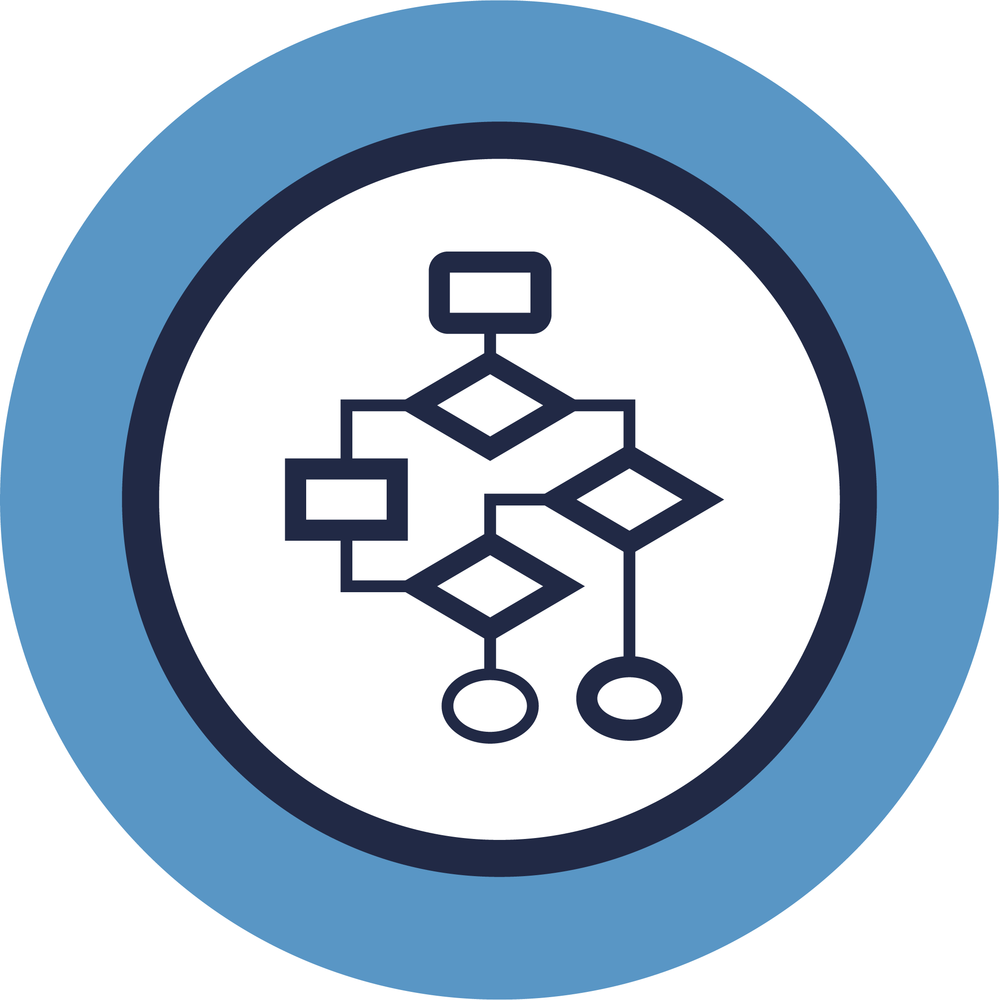
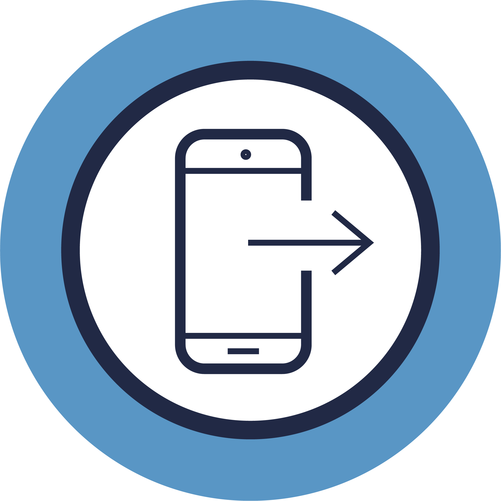

<h1>Apteco documentation</h1>

Everything you need to get the most out of your Apteco software.

[:lucide-arrow-right: &nbsp; Get started with Apteco][getting started]{ .md-button .md-button--primary } &nbsp; [What's new][whats new]{ .md-button }

 

-   { width="70" }

    <h3>Apteco Orbit</h3>

    Marketing insights platform for data analysis and campaign management.

    __[:octicons-arrow-right-24: Orbit][orbit]__

-   { width="70" }

    <h3>Apteco Customer Data Platform</h3>

    Unify customer datasets from external sources in the Apteco Cloud.

    __[:octicons-arrow-right-24: Connect][connect]__

-   { width="70" }

    <h3>Apteco Email and SMS</h3>

    Automate and manage email and SMS campaigns.

    __[:octicons-arrow-right-24: Channels][apteco email]__

---

-   { width="70" }

    <h3>Apteco FastStats</h3>

    Analyse large customer datasets to generate actionable insights.

    __[:octicons-arrow-right-24: FastStats][faststats]__

-   { width="70" }

    <h3>Apteco PeopleStage</h3>

    Create multi-channel campaigns and customer journeys.

    __[:octicons-arrow-right-24: PeopleStage][peoplestage]__

-   { width="70" }

    <h3>FastStats Designer</h3>

    Configure and build FastStats databases from external data sources.

    __[:octicons-arrow-right-24: Designer][designer]__

[getting started]: resources/getting-started.md
[whats new]: index.md#whats-new
[orbit]: orbit/index.md
[connect]: orbit/connect/index.md
[apteco email]: orbit/campaigns/apteco-email/index.md
[faststats]: faststats/index.md
[peoplestage]: peoplestage/index.md
[designer]: designer/index.md

 

## What's new { data-search-exclude }

-   <h4>🆕 Orin dashboard summaries</h4>

    Orin can generate intelligent summaries of your dashboards, providing instant overviews of the insights and visualisations they contain. 

    { width=900 }

    When you request a dashboard summary, Orin analyses the content and creates a concise description that you can share with colleagues or use to understand unfamiliar dashboards.

    
<i>Updated 19th March, 2026</i>

    
    [:lucide-arrow-right: &nbsp; Read the release notes][orbit release notes]{ .md-button .md-button--primary }

[orbit release notes]: resources/release-notes/orbit/2026.md

 

<h2>
Popular pages this week
</h2>

<a href='orbit/campaigns/create'>Creating a campaign</a>
<a href='orbit/dashboards/tiles'>Dashboard tiles</a>
<a href='orbit/connect/data-sources/salesforce'>Salesforce data source</a>
<a href='orbit/campaigns/quick-messages'>Quick messages</a>
<a href='resources/release-notes/orbit/2026'>Orbit release notes 2026</a>
<a href='orbit/campaigns/utm'>UTM code tracking</a>
<a href='orbit/dashboards/tiles/roi'>ROI number tile</a>
<a href='orbit/orin'>Orin AI assistant</a>
<a href='orbit/dashboards/filters/analysis'>Analysis filters</a>

<h2>More resources</h2>

-   :lucide-headset:{ .home-icons }

    <h3>Need support?</h3>

    If you didn't find the answer you're looking for, don't worry.

    We're here to help!

    __[Support][support]__

-   :lucide-graduation-cap:{ .home-icons }

    <h3>Learn with Apteco academy</h3>

    Master your Apteco software with structured courses, on-demand videos, and much more.

    __[Training][training]__

-   :lucide-tool-case:{ .home-icons }

    <h3>Resource hub</h3>

    Find everything you need in one place. From release notes and the roadmap to insights, ideas, and more.

    __[Resources][resources]__
    

[support]: resources/support.md
[training]: resources/training.md
[resources]: resources/index.md

 
