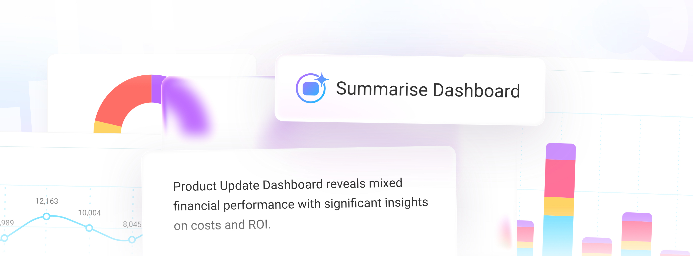
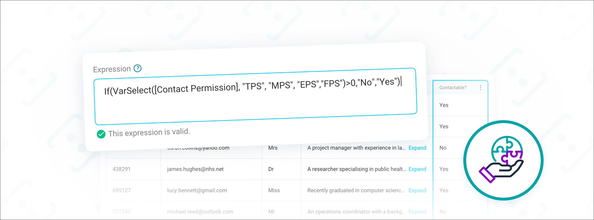

---
tags:
  - Resources
hide:
  - tags
---

# Orbit release notes 2026

!!! tip "Want to stay in the loop?"

    Join the [Apteco Insider Programme](releases/insider-programme.md) to get early access to upcoming features and the opportunity to shape our product development. You'll receive regular updates about new preview features and opportunities to participate in early testing.

## Version 2.3.2

5th February, 2026

### Headline feature

#### Orin dashboard summaries

Orin can generate intelligent summaries of your dashboards, providing instant overviews of the insights and visualisations they contain. When you request a dashboard summary, Orin analyses the content and creates a concise description that you can share with colleagues or use to understand unfamiliar dashboards.

This feature helps you:

- Get up to speed when working with dashboards created by colleagues
- Share dashboard insights with stakeholders without manually writing descriptions
- Onboard new team members more efficiently by providing context about existing analytics

!!! note

    You access the summary function through the option menu in Orbit, rather than typing in the Orin chat window.

For more details, see [Orin capabilities](../../../orbit/orin/index.md).

### New features and improvements

#### Find recently updated content with Orin

Orin's data navigator functionality now helps you locate dashboards, audiences, and campaigns based on recent activity. When you ask Orin about these items, it retrieves up to 10 of the most relevant results and can filter or sort them to match your needs.

#### Dashboard tile limit indicator

You can now see when you've reached the maximum of 15 tiles per dashboard tab. A visual indicator appears on the dashboard tab and in the details side panel when you're at the limit.

!!! note

    Text tiles don't count towards this limit. The 15-tile maximum applies to all other tile types.

### Bug fixes

- You can select profile tile columns with category limits applied to nested variables, and the filter correctly returns the expected results instead of unrelated categories.
- You can select a folder when creating an audience campaign without permissions enabled.
- Maps in audience workbooks now correctly retain your pan and zoom settings on the first attempt.
- You can no longer create a custom attribute in the Apteco CDP with the same name as a transactional table attribute when that table is disabled in the mapping.
- Orin retains your unsent message when you close and reopen it.
- Comparison tiles now correctly calculate the same period last year instead of using the previous period.
- The Orbit API now correctly applies your log settings when reading configuration from the FS_Config database.
- The ChatAPI correctly creates temporary tokens with UTC timestamps to prevent authentication failures in time zones behind UTC.

---

## Version 2.3.1

22nd January, 2026

### Headline feature

#### Expression support in data grids

You can now add custom Orbit expressions as columns in data grids used in dashboards and audience workbooks.

This gives you the flexibility to create calculated fields and transform data that can be combined with, and output alongside standard variables, in a single export.

### New features and improvements

#### Manual merge for Individual records

You can now manually merge duplicate Individual records in Orbit connect that automated identity resolution hasn't linked. This gives you direct control to consolidate records when you've identified specific duplicates through supporter contact, data audits, or external system information.

When you merge records, Orbit creates a new Individual record using details from the most recently updated record and links all associated data to it, including source URNs, contact details, and transactions. The system preserves original records in the full dataset and logs each merge operation for your reference.

#### Enhanced data preview when mapping CDP data

When configuring a Customer Data Table, the data preview now highlights the column you're editing and keeps the header row visible when scrolling, matching the experience you already have when mapping a User Defined Table.

#### Add all CDP tables to a system build in one step

When you create a new system build using Apteco CDP data, you can now add all mapped CDP tables and defined transaction tables at once, along with their relationships. You no longer need to manually select individual tables and configure their relationship structure separately.

#### Column mapping prevents duplicate assignments

When mapping data source columns, the system now removes columns from the dialogue once assigned. This prevents duplicate mappings that could cause data conflicts. Once you map a column to an attribute, it disappears from the dropdown list and search results.

!!! note

    You can still map multiple columns to **Email Address**, **Mobile Phone Number**, and **Landline Phone Number** attributes.

#### Custom attributes map automatically

When you map new data to your table columns, Orbit now automatically maps columns to your custom Individual and Contact Point attributes as well as the standard data structure fields, matching them by name regardless of capitalisation, spaces, or underscores. This means you no longer need to manually map custom attribute columns each time you import a new dataset.

#### External attributes for personalisation in Orbit

You can now use external attributes to personalise your messages in Orbit campaigns. External attributes are custom data fields stored in your external database. These give you more flexibility to tailor messages based on customer data that sits outside your core system. You also have the ability to select specific categories within each attribute for precise targeting.

#### Orin AI solution acceptance dialogue

When Orin creates a solution for you (such as an audience), you now see a confirmation dialogue that lets you accept the solution before it's finalised. This gives you a clear checkpoint to review Orin's work and ensure you're satisfied with the AI-generated output before proceeding.

### Bug fixes

- When you open data settings for Summary Profile tiles, the default **View As** setting now correctly shows as **Variables**.
- You now see the correct folder name when creating a campaign from a template at the root of your folder structure.
- You can now select map definition properties that aren't strings without encountering an error.

---

## Version 2.3.0

12th  January, 2026

### Headline feature

#### Orin AI assistant

Orin provides three levels of assistance to help you get the most from Orbit, depending on your bundle level:

- **Knowledge guide**: Orin helps you understand the capabilities of the Apteco Orbit platform
- **Data navigator**: Orin uses the details of your data to help you navigate the tables, variables, values, and resources in your system
- **Solution builder**: Orin helps you create your own resources

For more detail, see [Orin AI assistant](https://help.apteco.com/orbit/Content/Topics/orin.htm).

### New features and improvements

#### Transactional data in the Apteco CDP

You can now load transactional data directly into your Apteco CDP, creating hierarchical relationships between transaction types and individuals. Build multi-level transactional data structures, such as orders and order items, all linked to individual customer records, with support for incremental updates and custom attributes.

For more detail, see Loading transactional data to the CDP.

#### Copy dashboard tiles to multiple tabs

Copy a tile to multiple tabs within the same dashboard in a single action, saving time when you need to replicate tiles across your dashboard structure.

#### Filter data by selecting profile tiles

You can now select categories directly on detailed profile tiles and add them to your user filters on your dashboard.

#### N per limits support text variable ordering

N per limits can order records using text variables such as email address, with ascending or descending sort options. This extension gives you more flexibility when applying contact strategy rules to your audiences.

#### Clearer campaign menu labels

The campaign option menu now uses simplified labels with panel headers updated to match.

#### Manage folders from the folder view

You can now rename and delete folders directly from the option menu while viewing the folder's contents, with changes reflected immediately in the breadcrumb navigation.

### Bug fixes

- We’ve fixed an issue where individual attributes didn't update correctly when an individual had multiple values for the same attribute.
- Folder menus, filters, search, and grid layout options are now properly disabled when you view campaign overview and monitoring pages.
- Cell borders correctly display when you export a multi-column cube to PDF.
- You can now undo date changes in filters without encountering an error.
- You can now use the Return all values option in tables without incorrectly reverting when you saved your dashboard.
- The Venn chart segment filter preview now correctly displays when you exclude segments from your filter conditions.
- Text is now readable when selecting items in data grids, cubes, and tables by ensuring the text colour inverts correctly with the Orbit Default theme.
- Text tiles on dashboards now retain bold text and list formatting when you export to PDF.
- Comparison number tiles now correctly apply filters when you edit and reapply them without making changes.

---

## Version 2.3.0

12th  January, 2026

### Headline feature

#### Orin AI assistant

Orin provides three levels of assistance to help you get the most from Orbit, depending on your bundle level:

- **Knowledge guide**: Orin helps you understand the capabilities of the Apteco Orbit platform
- **Data navigator**: Orin uses the details of your data to help you navigate the tables, variables, values, and resources in your system
- **Solution builder**: Orin helps you create your own resources

For more detail, see [Orin AI assistant](https://help.apteco.com/orbit/Content/Topics/orin.htm).

### New features and improvements

#### Transactional data in the Apteco CDP

You can now load transactional data directly into your Apteco CDP, creating hierarchical relationships between transaction types and individuals. Build multi-level transactional data structures, such as orders and order items, all linked to individual customer records, with support for incremental updates and custom attributes.

For more detail, see Loading transactional data to the CDP.

#### Copy dashboard tiles to multiple tabs

Copy a tile to multiple tabs within the same dashboard in a single action, saving time when you need to replicate tiles across your dashboard structure.

#### Filter data by selecting profile tiles

You can now select categories directly on detailed profile tiles and add them to your user filters on your dashboard.

#### N per limits support text variable ordering

N per limits can order records using text variables such as email address, with ascending or descending sort options. This extension gives you more flexibility when applying contact strategy rules to your audiences.

#### Clearer campaign menu labels

The campaign option menu now uses simplified labels with panel headers updated to match.

#### Manage folders from the folder view

You can now rename and delete folders directly from the option menu while viewing the folder's contents, with changes reflected immediately in the breadcrumb navigation.

### Bug fixes

- We’ve fixed an issue where individual attributes didn't update correctly when an individual had multiple values for the same attribute.
- Folder menus, filters, search, and grid layout options are now properly disabled when you view campaign overview and monitoring pages.
- Cell borders correctly display when you export a multi-column cube to PDF.
- You can now undo date changes in filters without encountering an error.
- You can now use the Return all values option in tables without incorrectly reverting when you saved your dashboard.
- The Venn chart segment filter preview now correctly displays when you exclude segments from your filter conditions.
- Text is now readable when selecting items in data grids, cubes, and tables by ensuring the text colour inverts correctly with the Orbit Default theme.
- Text tiles on dashboards now retain bold text and list formatting when you export to PDF.
- Comparison number tiles now correctly apply filters when you edit and reapply them without making changes.

---

## Version 2.3.0

12th  January, 2026

### Headline feature

#### Orin AI assistant

Orin provides three levels of assistance to help you get the most from Orbit, depending on your bundle level:

- **Knowledge guide**: Orin helps you understand the capabilities of the Apteco Orbit platform
- **Data navigator**: Orin uses the details of your data to help you navigate the tables, variables, values, and resources in your system
- **Solution builder**: Orin helps you create your own resources

For more detail, see [Orin AI assistant](https://help.apteco.com/orbit/Content/Topics/orin.htm).

### New features and improvements

#### Transactional data in the Apteco CDP

You can now load transactional data directly into your Apteco CDP, creating hierarchical relationships between transaction types and individuals. Build multi-level transactional data structures, such as orders and order items, all linked to individual customer records, with support for incremental updates and custom attributes.

For more detail, see Loading transactional data to the CDP.

#### Copy dashboard tiles to multiple tabs

Copy a tile to multiple tabs within the same dashboard in a single action, saving time when you need to replicate tiles across your dashboard structure.

#### Filter data by selecting profile tiles

You can now select categories directly on detailed profile tiles and add them to your user filters on your dashboard.

#### N per limits support text variable ordering

N per limits can order records using text variables such as email address, with ascending or descending sort options. This extension gives you more flexibility when applying contact strategy rules to your audiences.

#### Clearer campaign menu labels

The campaign option menu now uses simplified labels with panel headers updated to match.

#### Manage folders from the folder view

You can now rename and delete folders directly from the option menu while viewing the folder's contents, with changes reflected immediately in the breadcrumb navigation.

### Bug fixes

- We’ve fixed an issue where individual attributes didn't update correctly when an individual had multiple values for the same attribute.
- Folder menus, filters, search, and grid layout options are now properly disabled when you view campaign overview and monitoring pages.
- Cell borders correctly display when you export a multi-column cube to PDF.
- You can now undo date changes in filters without encountering an error.
- You can now use the Return all values option in tables without incorrectly reverting when you saved your dashboard.
- The Venn chart segment filter preview now correctly displays when you exclude segments from your filter conditions.
- Text is now readable when selecting items in data grids, cubes, and tables by ensuring the text colour inverts correctly with the Orbit Default theme.
- Text tiles on dashboards now retain bold text and list formatting when you export to PDF.
- Comparison number tiles now correctly apply filters when you edit and reapply them without making changes.

---

## Version 2.3.0

12th  January, 2026

### Headline feature

#### Orin AI assistant

Orin provides three levels of assistance to help you get the most from Orbit, depending on your bundle level:

- **Knowledge guide**: Orin helps you understand the capabilities of the Apteco Orbit platform
- **Data navigator**: Orin uses the details of your data to help you navigate the tables, variables, values, and resources in your system
- **Solution builder**: Orin helps you create your own resources

For more detail, see [Orin AI assistant](https://help.apteco.com/orbit/Content/Topics/orin.htm).

### New features and improvements

#### Transactional data in the Apteco CDP

You can now load transactional data directly into your Apteco CDP, creating hierarchical relationships between transaction types and individuals. Build multi-level transactional data structures, such as orders and order items, all linked to individual customer records, with support for incremental updates and custom attributes.

For more detail, see Loading transactional data to the CDP.

#### Copy dashboard tiles to multiple tabs

Copy a tile to multiple tabs within the same dashboard in a single action, saving time when you need to replicate tiles across your dashboard structure.

#### Filter data by selecting profile tiles

You can now select categories directly on detailed profile tiles and add them to your user filters on your dashboard.

#### N per limits support text variable ordering

N per limits can order records using text variables such as email address, with ascending or descending sort options. This extension gives you more flexibility when applying contact strategy rules to your audiences.

#### Clearer campaign menu labels

The campaign option menu now uses simplified labels with panel headers updated to match.

#### Manage folders from the folder view

You can now rename and delete folders directly from the option menu while viewing the folder's contents, with changes reflected immediately in the breadcrumb navigation.

### Bug fixes

- We’ve fixed an issue where individual attributes didn't update correctly when an individual had multiple values for the same attribute.
- Folder menus, filters, search, and grid layout options are now properly disabled when you view campaign overview and monitoring pages.
- Cell borders correctly display when you export a multi-column cube to PDF.
- You can now undo date changes in filters without encountering an error.
- You can now use the Return all values option in tables without incorrectly reverting when you saved your dashboard.
- The Venn chart segment filter preview now correctly displays when you exclude segments from your filter conditions.
- Text is now readable when selecting items in data grids, cubes, and tables by ensuring the text colour inverts correctly with the Orbit Default theme.
- Text tiles on dashboards now retain bold text and list formatting when you export to PDF.
- Comparison number tiles now correctly apply filters when you edit and reapply them without making changes.

---

## Version 2.3.0

12th  January, 2026

### Headline feature

#### Orin AI assistant

Orin provides three levels of assistance to help you get the most from Orbit, depending on your bundle level:

- **Knowledge guide**: Orin helps you understand the capabilities of the Apteco Orbit platform
- **Data navigator**: Orin uses the details of your data to help you navigate the tables, variables, values, and resources in your system
- **Solution builder**: Orin helps you create your own resources

For more detail, see [Orin AI assistant](https://help.apteco.com/orbit/Content/Topics/orin.htm).

### New features and improvements

#### Transactional data in the Apteco CDP

You can now load transactional data directly into your Apteco CDP, creating hierarchical relationships between transaction types and individuals. Build multi-level transactional data structures, such as orders and order items, all linked to individual customer records, with support for incremental updates and custom attributes.

For more detail, see Loading transactional data to the CDP.

#### Copy dashboard tiles to multiple tabs

Copy a tile to multiple tabs within the same dashboard in a single action, saving time when you need to replicate tiles across your dashboard structure.

#### Filter data by selecting profile tiles

You can now select categories directly on detailed profile tiles and add them to your user filters on your dashboard.

#### N per limits support text variable ordering

N per limits can order records using text variables such as email address, with ascending or descending sort options. This extension gives you more flexibility when applying contact strategy rules to your audiences.

#### Clearer campaign menu labels

The campaign option menu now uses simplified labels with panel headers updated to match.

#### Manage folders from the folder view

You can now rename and delete folders directly from the option menu while viewing the folder's contents, with changes reflected immediately in the breadcrumb navigation.

### Bug fixes

- We’ve fixed an issue where individual attributes didn't update correctly when an individual had multiple values for the same attribute.
- Folder menus, filters, search, and grid layout options are now properly disabled when you view campaign overview and monitoring pages.
- Cell borders correctly display when you export a multi-column cube to PDF.
- You can now undo date changes in filters without encountering an error.
- You can now use the Return all values option in tables without incorrectly reverting when you saved your dashboard.
- The Venn chart segment filter preview now correctly displays when you exclude segments from your filter conditions.
- Text is now readable when selecting items in data grids, cubes, and tables by ensuring the text colour inverts correctly with the Orbit Default theme.
- Text tiles on dashboards now retain bold text and list formatting when you export to PDF.
- Comparison number tiles now correctly apply filters when you edit and reapply them without making changes.

---

## Version 2.3.0

12th  January, 2026

### Headline feature

#### Orin AI assistant

Orin provides three levels of assistance to help you get the most from Orbit, depending on your bundle level:

- **Knowledge guide**: Orin helps you understand the capabilities of the Apteco Orbit platform
- **Data navigator**: Orin uses the details of your data to help you navigate the tables, variables, values, and resources in your system
- **Solution builder**: Orin helps you create your own resources

For more detail, see [Orin AI assistant](https://help.apteco.com/orbit/Content/Topics/orin.htm).

### New features and improvements

#### Transactional data in the Apteco CDP

You can now load transactional data directly into your Apteco CDP, creating hierarchical relationships between transaction types and individuals. Build multi-level transactional data structures, such as orders and order items, all linked to individual customer records, with support for incremental updates and custom attributes.

For more detail, see Loading transactional data to the CDP.

#### Copy dashboard tiles to multiple tabs

Copy a tile to multiple tabs within the same dashboard in a single action, saving time when you need to replicate tiles across your dashboard structure.

#### Filter data by selecting profile tiles

You can now select categories directly on detailed profile tiles and add them to your user filters on your dashboard.

#### N per limits support text variable ordering

N per limits can order records using text variables such as email address, with ascending or descending sort options. This extension gives you more flexibility when applying contact strategy rules to your audiences.

#### Clearer campaign menu labels

The campaign option menu now uses simplified labels with panel headers updated to match.

#### Manage folders from the folder view

You can now rename and delete folders directly from the option menu while viewing the folder's contents, with changes reflected immediately in the breadcrumb navigation.

### Bug fixes

- We’ve fixed an issue where individual attributes didn't update correctly when an individual had multiple values for the same attribute.
- Folder menus, filters, search, and grid layout options are now properly disabled when you view campaign overview and monitoring pages.
- Cell borders correctly display when you export a multi-column cube to PDF.
- You can now undo date changes in filters without encountering an error.
- You can now use the Return all values option in tables without incorrectly reverting when you saved your dashboard.
- The Venn chart segment filter preview now correctly displays when you exclude segments from your filter conditions.
- Text is now readable when selecting items in data grids, cubes, and tables by ensuring the text colour inverts correctly with the Orbit Default theme.
- Text tiles on dashboards now retain bold text and list formatting when you export to PDF.
- Comparison number tiles now correctly apply filters when you edit and reapply them without making changes.

---

## Version 2.3.0

12th  January, 2026

### Headline feature

#### Orin AI assistant

Orin provides three levels of assistance to help you get the most from Orbit, depending on your bundle level:

- **Knowledge guide**: Orin helps you understand the capabilities of the Apteco Orbit platform
- **Data navigator**: Orin uses the details of your data to help you navigate the tables, variables, values, and resources in your system
- **Solution builder**: Orin helps you create your own resources

For more detail, see [Orin AI assistant](https://help.apteco.com/orbit/Content/Topics/orin.htm).

### New features and improvements

#### Transactional data in the Apteco CDP

You can now load transactional data directly into your Apteco CDP, creating hierarchical relationships between transaction types and individuals. Build multi-level transactional data structures, such as orders and order items, all linked to individual customer records, with support for incremental updates and custom attributes.

For more detail, see Loading transactional data to the CDP.

#### Copy dashboard tiles to multiple tabs

Copy a tile to multiple tabs within the same dashboard in a single action, saving time when you need to replicate tiles across your dashboard structure.

#### Filter data by selecting profile tiles

You can now select categories directly on detailed profile tiles and add them to your user filters on your dashboard.

#### N per limits support text variable ordering

N per limits can order records using text variables such as email address, with ascending or descending sort options. This extension gives you more flexibility when applying contact strategy rules to your audiences.

#### Clearer campaign menu labels

The campaign option menu now uses simplified labels with panel headers updated to match.

#### Manage folders from the folder view

You can now rename and delete folders directly from the option menu while viewing the folder's contents, with changes reflected immediately in the breadcrumb navigation.

### Bug fixes

- We’ve fixed an issue where individual attributes didn't update correctly when an individual had multiple values for the same attribute.
- Folder menus, filters, search, and grid layout options are now properly disabled when you view campaign overview and monitoring pages.
- Cell borders correctly display when you export a multi-column cube to PDF.
- You can now undo date changes in filters without encountering an error.
- You can now use the Return all values option in tables without incorrectly reverting when you saved your dashboard.
- The Venn chart segment filter preview now correctly displays when you exclude segments from your filter conditions.
- Text is now readable when selecting items in data grids, cubes, and tables by ensuring the text colour inverts correctly with the Orbit Default theme.
- Text tiles on dashboards now retain bold text and list formatting when you export to PDF.
- Comparison number tiles now correctly apply filters when you edit and reapply them without making changes.
